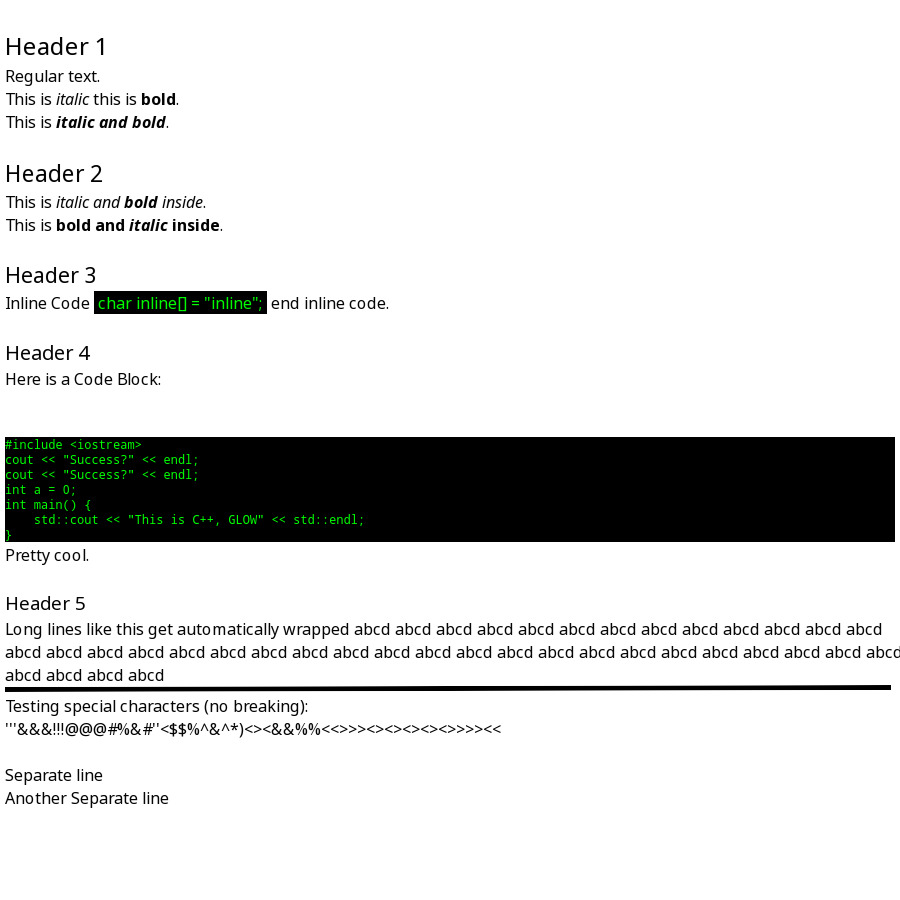

## Render Markdown
Renders markdown files to image or terminal.

#### Rendering:
ImageMagick (Magick++ API)

#### Terminal display:
Kitty Graphics Protocol.

## Usage:
```
RenderMarkdown [options] [input-file] [output-file]
Allowed Options:

Basic Options:
  -h [ --help ]                         print help
  -H [ --help-config ]                  print configuration file help
  -t [ --test ]                         run tests
  -c [ --config ] arg (=/home/maceurt/.config/render_markdown/config.ini)
                                        Config File
  -i [ --input-file ] arg               input file
  -o [ --output-file ] arg              output file
  -R [ --overwrite ]                    overwrite output file
  -d [ --display ]                      display to terminal

More Options:
  -W [ --width ] arg (=800)             Canvas width
  -H [ --height ] arg (=1000)           Canvas height

ERRORS:
    1 - Argument
    2 - File
    3 - Write
    4 - Config
```


#### Configuration File Usage (Work in progress):
```
Config File Options:

Config Specific Options:

Other Options:
  -W [ --width ] arg (=800)    Canvas width
  -H [ --height ] arg (=1000)  Canvas height
```

## Required Libraries:
- Magick++ : https://imagemagick.org/script/magick++.php
- Boost    : Boost

## Installing/Compiling
Ensure you have installed the required libraries.

1. `meson setup build`
2. `meson compile -C build`

Build files and binary (`RenderMarkdown`) will be in the `build` directory.

### Optional
After building, run `meson install -C build` to insall binary to your system.

## Images


